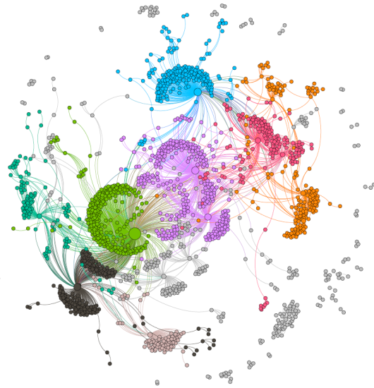

## GRaNIE: Reconstruction of data-driven, cell type specific gene regulatory networks including enhancers using chromatin accessibility and RNAseq data

### Repository structure

This repository is for our *GRaNIE* package (**G**ene **R**egul**a**tory **N**etwork **I**nference including **E**nhancers). The accompanying [website](https://grp-zaugg.embl-community.io/GRaNIE) is **not** part of Bioconductor and independently build and maintained based on the development version of *GRaNIE*, which is hosted [in this repository](https://git.embl.de/grp-zaugg/GRaNIE). It may therefore differ from the *release version* of the package.

For the *GRaNPA* package, see [here](https://grp-zaugg.embl-community.io/GRaNPA).

### Installation

*GRaNIE* is now included on *Bioconductor*. The package and installation instructions can be found here and is suitable for the most users, which installs the package from the release branch of Bioconductor: [https://bioconductor.org/packages/GRaNIE](https://bioconductor.org/packages/GRaNIE). **Make sure to use only the latest Bioconductor version (currently, 3.16).**

**As the package is still under very active development, we however recommend to either use the development version of Bioconductor for being able to install the latest versions OR to install the newest version of the package outside of the official Bioconductor release cycle** (i.e., a devel version that however does not necessarily require even the latest Bioconductor version to be installed).

For the latter option, you may use the following line that will install the package directly from the Gitlab instance that also hosts the package website. Due to potential package conflicts with existing (Bioconductor) packages, we cannot guarantee this always works, though:
`devtools::install_gitlab("grp-zaugg/GRaNIE", host = "git.embl.de", subdir = "src/GRaNIE", force = TRUE)`. You only need the ``devtools`` package for this. If you run into any problems, let us know!

### Documentation

A very detailed documentation for the latest development version of the package is available here at [https://grp-zaugg.embl-community.io/GRaNIE](https://grp-zaugg.embl-community.io/GRaNIE). We currently provide multiple vignettes as well as the R help in an online format. Both are regularly updated and extended.

### Citation
**If you use our packages, please use the following citation:**

Kamal, A., Arnold, C., Claringbould, A., Moussa, R., Servaas, N.H., Kholmatov, M., Daga, N., Nogina, D., Mueller‐Dott, S., Reyes‐Palomares, A. and Palla, G., 2023. GRaNIE and GRaNPA: inference and evaluation of enhancer‐mediated gene regulatory networks. Molecular Systems Biology, p.e11627.; doi: [https://doi.org/10.15252/msb.202311627](https://doi.org/10.15252/msb.202311627)

### Bug Reports, Feature Requests and Contact Information

For issues, bugs, and feature request, please see the [Issue Tracker](https://git.embl.de/grp-zaugg/GRaNIE/issues). 

**We are actively working on the package and regularly improve upon features, add features, or change features for increased clarity. This sometimes results in minor changes to the workflow, changed argument names or other small incompatibilities that may result in errors when running a version of the package that differs from the version this vignette has been run for.**
**Thus, make sure to run a version of `GRaNIE` that is compatible with this vignette. If in doubt or when you receive errors, check the R help, which always contains the most up-to-date documentation.**

If you have other questions or comments, feel free to contact us. We will be happy to answer any questions related to this project as well as questions related to the software implementation. For method-related questions, contact Judith B. Zaugg (judith.zaugg@embl.de). For technical questions, contact Christian Arnold (christian.arnold@embl.de). We will aim to respond in a timely manner.

 

