```{r <knitr, echo=FALSE, message=FALSE, results="hide", class.output="scroll-200"}
library("knitr")
opts_chunk$set(
  tidy = TRUE,
  cache = FALSE,
  message = FALSE,
  fig.align="center")
```

```{=html}
<style type="text/css">
.main-container {
  max-width: 100% !important;
  margin: auto;
}
</style>
```
# Motivation and Necessity {#motivation}

Genetic variants associated with diseases often affect non-coding
regions, thus likely having a regulatory role. To understand the effects
of genetic variants in these regulatory regions, identifying genes that
are modulated by specific regulatory elements (REs) is crucial. The
effect of gene regulatory elements, such as enhancers, is often
cell-type specific, likely because the combinations of transcription
factors (TFs) that are regulating a given enhancer have cell-type
specific activity. This TF activity can be quantified with existing
tools such as `diffTF` and captures differences in binding of a TF in
open chromatin regions. Collectively, this forms a enhancer-mediated
gene regulatory network (`eGRN`) with cell-type and data-specific TF-RE
and RE-gene links. Here, we reconstruct such a `eGRN` using bulk RNA-seq
and open chromatin (e.g., using ATAC-seq or ChIP-seq for open chromatin
marks) and optionally TF activity data. Our network contains different
types of links, connecting TFs to regulatory elements, the latter of
which is connected to genes in the vicinity or within the same chromatin
domain (*TAD*). We use a statistical framework to assign empirical FDRs
and weights to all links using a permutation-based approach.

In summary, we present a framework to reconstruct predictive
enhancer-mediated regulatory network models that are based on
integrating of expression and chromatin accessibility/activity pattern
across individuals, and provide a comprehensive resource of cell-type
specific gene regulatory networks for particular cell types.

For the latest version of the paper, see the [References](#refs).

# Installation

## `GRaNIE` package and required dependency packages

`GRaNIE` is available on *Bioconductor*. [The package and installation
instructions can be found
here](https://bioconductor.org/packages/GRaNIE) and are very simple.

The basic installation installs all required packages but not
necessarily those that are listed under `Suggests` unless you installed
the package with `BiocManager::install("GRaNIE", dependencies = TRUE)`.

**Note that from the additional packages, only some of the genome
annotation packages are actually also required, which of them, however,
depends on your genome assembly version (see below).**

## Additional packages

Overall, we tried to minimize the installation burden and only require
packages if they are absolutely necessary for the main workflow. If you
want to pre-install also all optional packages, please consider the
following options:

1.  Use `BiocManager::install("GRaNIE", dependencies = TRUE)` which
    however installs all annotation packages for all supported genomes,
    which may take a longer time due to the overall download size of
    multiple Gb.
2.  Install only the required annotation packages, along with all other
    optional packages. You may use the following for it:
    -   Genome annotation packages (only one of the four is optionally
        needed for some functions, see section below, which of them
        depends on your genome assembly version):

        -   hg38:
            `BiocManager::install(c("org.Hs.eg.db", "BSgenome.Hsapiens.UCSC.hg38", "TxDb.Hsapiens.UCSC.hg38.knownGene"))`
        -   hg19:
            `BiocManager::install(c("org.Hs.eg.db", "BSgenome.Hsapiens.UCSC.hg19", "TxDb.Hsapiens.UCSC.hg19.knownGene"))`
        -   mm10:
            `BiocManager::install(c("org.Mm.eg.db", "BSgenome.Mmusculus.UCSC.mm10", "TxDb.Mmusculus.UCSC.mm10.knownGene"))`
        -   mm9
            `BiocManager::install(c("org.Mm.eg.db", "BSgenome.Mmusculus.UCSC.mm9", "TxDb.Mmusculus.UCSC.mm9.knownGene"))`

    -   For all other optional packages:
        `BiocManager::install(c("IHW", "robust", "csaw", "EDASeq", "ChIPseeker", "variancePartition", "ReactomePA", "DOSE", "clusterProfiler", "BiocFileCache", "BiocParallel"))`

## Detailed information about the scope of the optional packages

`GRaNIE` has a number of packages that enhance the functionality for
particular cases, may be required depending on certain parameters, only
when using a particular functionality or that generally speed-up the
computation. In detail, the following packages are currently optional
and may be needed context-specifically:

-   **Genome assembly and annotation packages** (only one of the four is
    optionally needed, which of them depends on your genome assembly
    version)

    -   **all of the following packages are ONLY needed for either
        additional peak annotation in combination with `ChIPseeker` (see
        below) or if the chosen peak normalization method is GC-based:
        `EDASeq_GC_peaks`, `gcqn_peaks`**
    -   `org.Hs.eg.db`: Needed only when genome assembly version is
        `hg19` or `hg38`
    -   `org.Mm.eg.db`: Needed only when genome assembly version is
        `mm9` or `mm10`
    -   `BSgenome.Hsapiens.UCSC.hg19`,
        `TxDb.Hsapiens.UCSC.hg19.knownGene`: Needed only when genome
        assembly version is `hg19`\
    -   `BSgenome.Hsapiens.UCSC.hg38`,
        `TxDb.Hsapiens.UCSC.hg38.knownGene`: Needed only when genome
        assembly version is `hg38`\
    -   `BSgenome.Mmusculus.UCSC.mm10`,
        `TxDb.Mmusculus.UCSC.mm10.knownGene`: Needed only when genome
        assembly version is `mm10`\
    -   `BSgenome.Mmusculus.UCSC.mm9`,
        `TxDb.Mmusculus.UCSC.mm9.knownGene`: Needed only when genome
        assembly version is `mm9`\
    -   `ChIPseeker`: Not needed strictly speaking, but used only for
        the function `addData()` to provide additional peak annotation,
        fully optional otherwise.

-   **Additional statistical packages and for enhanced functionality**

    -   `IHW`: Needed only for the function `filterGRNAndConnectGenes()`
        for p-value adjustment of the raw peak-gene p-values when using
        the `IHW` framework (parameter `peak_gene.fdr.method`)
    -   `robust`: Needed only when setting `addRobustRegression = TRUE`
        in the functions `addConnections_peak_gene()` and
        `add_TF_gene_correlation()` for enabling robust regression (an
        experimental, largely undocumented feature so far).
    -   `csaw`: Needed only for a *cyclic LOESS* normalization in `addData()`, which is
        the default normalization currently for adding TF activity data
        via `addData_TFActivity()`
    -   `EDASeq`: Provides additional, GC-aware normalization schemes for the peak data in in `addData().
    -   `variancePartition`: Needed only for the function
        `add_featureVariation()` to quantify multiple sources of
        biological and technical variation for features (TFs, peaks, and
        genes)

-   **Enrichment-associated packages**

    -   `topGO`, `ReactomePA`, `DOSE`, `clusterProfiler`: Needed only
        for all enrichment functions for `GO`, `Reactome`, `DO`, and
        `KEGG` respectively

-   **Computational efficacy**

    -   `BiocFileCache`: Needed only for `loadExampleObject()`, in cases
        when this function is executed multiple times, caching is
        considerably faster than re-downloading the file anew every time
        the function is executed.
    -   `BiocParallel`: Only used but highly recommended in the
        functions `addConnections_peak_gene()`,
        `add_TF_gene_correlation()`, and `overlapPeaksAndTFBS()` to
        speed-up computation when requesting multiple cores.

# Example Workflow {#workflow}

Check the [workflow vignette for an example workflow with explanations,
figures and results](GRaNIE_workflow.html).

# Example GRN object

For user convenience, we provide an example object via a designated helper function. This can be
retrieved simply by running the following line of code, as explained also in the R help:

```{r eval = FALSE}
 GRN = loadExampleObject()
```

You can start by simply typing `GRN` (i.e., the object name) into the console, and a summary of the GRN object is printed. **The example object is always up to date with the most recent version of the package and everything that the package can calculate is contained in the object. Thus, you can run any function after loading the example object.**

# Input {#input}

In our `GRaNIE` approach, we integrate multiple data modalities. Here,
we describe them in detail and their required format.

## Open chromatin and RNA-seq data {#input_peaks}

Open chromatin data may come from ATAC-seq, DNAse-seq or ChIP-seq data
for particular histone modifications that associate with open chromatin
such as histone acetylation (e.g., H3K27ac). They all capture open
chromatin either directly or indirectly, and while we primarily tested
and used ATAC-seq while developing the package, the others should also
be applicable for our framework. *From here on, we will refer to these
regions simply as peaks.*

For RNA-seq, the data represent expression counts per gene across
samples.

Here is a quick graphical representation which format is required to be
compatible with our framework:

-   columns are samples, rows are peaks / genes
-   column names are required while row names are ignored
-   except for one ID columns, all other columns must be numeric and
    represent counts per sample
-   ID column:
    -   The name of the ID column can be anything and can be specific
        later in the pipeline. For peaks, we usually use `peakID` while
        for RNA-seq, we use `EnsemblID`
    -   for peaks, the required format is "chr:start-end", with `chr`
        denoting the chromosome, followed by `:`, and then `start`, `-`,
        and `end` for the peak start and end, respectively. Coordinates
        are assumed to be zero-based exclusive, the standard for BED
        files, see
        [here](https://arnaudceol.wordpress.com/2014/09/18/chromosome-coordinate-systems-0-based-1-based/)
        or [here](http://genome.ucsc.edu/FAQ/FAQformat.html#format1) for
        more information. In short, the first base in a chromosome is
        numbered 0, and the last base is not included in the feature.
        For example, a peak with the coordinates `chr1:100-150` starts
        at position 100 (or the 101th base of the chromosome, as
        counting starts with 0), spans 50 bp and ends at 149 (and NOT
        150).
-   counts should be raw if possible (that is, integers), but we also
    support pre-normalized data. [See here for more
    information.](#methods_dataNorm)
-   peak and RNA-seq data may contain a distinct set of samples, with
    some samples overlapping but others not. This is no issue and as
    long as *some* samples are found in both of them, the `GRaNIE`
    pipeline can work with it. Note that only the shared samples between
    both data modalities are kept, however, so make sure that the sample
    names match between them and share as many samples as possible. See
    the methods part for guidelines on how many samples we recommend.

Note that peaks should not overlap. If they do, an informative error
message is thrown and the user is requested to modify the peak input
data so that no overlaps exist among all peaks. This can be done by
either merging overlapping peaks or deleting those that overlap with
other peaks based on other criteria such as peak signal, by keeping only
the strongest peak, for example.

For guidelines on how many peaks are necessary or recommended, see [the section below](#guidelines).

**For guidelines on whether and how to prepare single-cell 10x multiome data, see [here](#guidelines_singleCell).**

## TF and TFBS data {#input_TF}

TF and TFBS data is mandatory as input. Specifically, the package
requires a `bed` file per TF with TF binding sites (TFBS). TFBS can
either be in-silico predicted, or experimentally verified, as long as
genome-wide TFBS can be used. For convenience and orientation, we
provide TFBS predictions for HOCOMOCO-based TF motifs that were used
with `PWMScan` for `hg19`, `hg38` and `mm10`. Check the [workflow vignette for an example](GRaNIE_workflow.html).

**We recommend to download the full HOCOMOCO TFBS data from [here](https://difftf.readthedocs.io/en/latest/chapter2.html#dir-tfbs). In short, we provide example files for all supported genome assemblies (*hg19*, *hg38* and *mm10*) that are fully compatible with `GRaNIE` as separate downloads. While we also provide TFBS data for FIMO, we recommend using HOCOMOCO.**


However, you may also use your own TFBS data, and we provide full
flexibility in doing so. Only some manual preparation is necessary.
Briefly, if you decide to use your own TFBS data, you have to prepare
the following:

-   a folder that contains one TFBS file per TF in `bed` or `bed.gz`
    format, 6 columns
-   file names must be `{TF}{suffix}.{fileEnding}`, where `{TF}`
    specifies the name of the TF, `{suffix}` an optional and arbitrary
    string (we use `_TFBS`, for example), and `{fileEnding}` the file
    type (supported are `bed` and `bed.gz`).
-   the folder must also contain a so-called translation table that must
    be called `translationTable.csv`. This file must have the following
    structure: 3 columns (tab-separated), called `SYMBOL`, `ENSEMBL`,
    and `HOCOID`. The first column denotes a symbol or shortcut for the
    TF that is used throughout the pipeline (e.g., `AHR`), the second
    the ENSEMBL ID (without the dot suffix; e.g., `ENSG00000106546`) and
    the third column the prefix of how the file is called with the TFBS
    (e.g., `AHR.0.B` if the file for `AHR` is called
    `AHR.0.B_TFBS.bed.gz`).
-   we provide example files for all supported genome assemblies (hg19,
    hg38 and mm10) that are fully compatible with `GRaNIE` as separate
    downloads. For more information, check
    [here](https://difftf.readthedocs.io/en/latest/chapter2.html#dir-tfbs).

For more methodological details, details on how to construct these
files, their exact format etc we refer to `diffTF` paper and
[website](https://difftf.readthedocs.io/) for details.

## Sample metadata (optional but highly recommended) {#input_metadata}

Providing sample metadata is optional, but highly recommended - if
available, the sample metadata is integrated into the PCA plots to
understand where the variation in the data comes from and whether any of
the metadata (e.g., age, sex, sequencing batch) is associated with the
PCs from a PC, indicating a batch effect that needs to be addressed
before running the `GRaNIE` pipeline.

The integration of sample metadata can be achieved in the `addData()`
function (click the link for more information).

## Hi-C data (optional) {#input_HiC}

Integration of Hi-C data is optional and serves as alternative to
identifying peak-gene pairs to test for correlation based on a
predefined and fixed *neighborhood* size (see
[Methods](#methods_peakGene)).

If TAD domains are used, the neighborhood of a peak will be defined by the TAD the peak is located in, and all
genes in the same TAD will be tested for correlation. If the TAD is very narrow, this consequently results in fewer genes to be tested as compared to a fixed 250 kb neighborhood (the default), for example, while the opposite is true for a large megabase-long TAD domain.

If Hi-C data are available, the pipeline expects a BED file format with
at least 3 columns: `chromosome name`, `start`, and `end`. An `ID`
column is optional and assumed to be in the 4th column, all additional
columns are ignored.

For more details, see the R help (`?addConnections_peak_gene`) and the
[Methods](#methods_peakGene).

## SNP data (optional, coming soon) {#input_SNP}

We also plan to integrate SNP data soon, stay tuned!

# Methodological Details and Basic Mode of Action {#methods}

In this section, we give methodological details and guidelines.

## Data normalization {#methods_dataNorm}

An important consideration is data normalization for RNA and open
chromatin data. We currently support six choices of normalization of
either peak or RNA-Seq data: `limma_quantile`, `DESeq2_sizeFactors`,
`limma_cyclicloess`, `limma_scale`, `csaw_cyclicLoess_orig`, `csaw_TMM`
plus `none` to skip normalization altogether. For peaks, two additional
GC-based normalization schemes are offered: `EDASeq_GC_peaks` and
`gcqn_peaks`. We refer to the R help for more details (`?addData`). The
default for RNA-Seq is a quantile normalization, while for the open
chromatin peak data, it is `DESeq2_sizeFactors` (i.e., a "regular"
`DESeq2` size factor normalization). Importantly, `DESeq2_sizeFactors`
requires raw data, while `limma_quantile` does not necessarily. We
nevertheless recommend raw data as input, although it is also possible
to provide pre-normalized data as input and then topping this up with
another normalization method or `none`.

While we recommend raw counts for both peaks and RNA-Seq as input and
offer several normalization choices in the pipeline, it is also possible
to provide pre-normalized data. Note that the normalization method may
have a large influence on the resulting  `eGRN`  network, so make sure the
choice of normalization is reasonable. For more details, see the next
sections.

## Permutations {#methods_permutedData}

We integrate a permutation-based approach into our framework for
assessing the quality and abundance of both TF-enhancer and
enhancer-gene links. That is, data are permuted in addition to the real
data for comparison. Specifically, we permute the samples labels for the
RNA-seq data and run the whole pipeline for both permuted and
non-permuted data. This allows to compare the connectivity for the real
and random *eGRNs*.

Internally, we label the permuted data with a "1", while the
non-permuted data is labeled as "0" in the `GRN` object. For example,
`GRN@connections$TF_peaks[["0"]]` stores the original, non-permuted
connections, while `GRN@connections$TF_peaks[["1"]]` stores those based
on permuted data.

All output files should either contain the `permuted` label to designate
that permuted data have been used to generate the plot, while the
original, non-permuted version is labeled as `original`.

## TF-peak connections {#methods_TF_peak}

Generally speaking, TF-peak connections are found by correlating a
suitable measure related to TFs with peak accessibility, and then
identifying statistically significant links. By default, TF *expression*
is used as TF measure, but we also implemented an additional measure for
establishing these links based on a measure called *TF activity* (see
below). For more details on how we establish TF-peak links, please check
the Supplement of the corresponding publication. See [References](#refs)
for links.

### TF Activity connections {#methods_TF_peak_TFActivity}

As explained above, TF-peak connections are found by correlation TF
*expression* with peak accessibility. In addition to *expression*, we
also offer to identify statistically significant TF-peak links based on
*TF Activity*. The concept of TF Activity is described in more detail in
our `diffTF` paper. In short, we define TF motif activity, or TF
activity for short, as the effect of a TF on the state of chromatin as
measured by chromatin accessibility or active chromatin marks (i.e.,
ATAC-seq, DNase sequencing [DNase-seq], or histone H3 lysine 27
acetylation [H3K27ac] ChIP-seq). A *TF Activity* score is therefore
needed *for each TF and each sample*.

TF Activity information can either be calculated within the `GRaNIE`
framework [using a simplified and empirical
approach)](#methods_TF_peak_TFActivity_calculating) or it can be
calculated outside of our framework using designated methods and then
[imported into our framework](#methods_TF_peak_TFActivity_importing). We
now describe these two choices in more detail.

#### Calculating TF Activity {#methods_TF_peak_TFActivity_calculating}

In our `GRaNIE` approach, we empirically estimate TF Activity for each
TF with the following approach:

-   normalize the raw peak counts by one of the supported normalization
    methods (see below)
-   from the TF-peak accessibility matrix as calculated before, identify
    the subset of peaks with a TFBS overlap for the particular TF based
    on the user-provided TFBS data
-   scaling and centering of the normalized accessibility scores per row
    (i.e., peak) so that row means are close to 0 for each peak
-   the column means (i.e., sample means) from the scaled and centered
    counts are then taken as approximation for the TF Activity

By default, we currently offer the four different types of normalizing
the raw data for calculating TF Activity. Options 2 to 4 are described
in more detail in the section [Data normalization above](#methods_dataNorm), while option 1 is currently only available
for TF Activity and therefore explained below (this may change in the
future):

1.  Cyclic LOESS normalization (default) <br/> Local regression (LOESS)
    is a commonly used approach for fitting flexible non-linear
    functions, which involves computing many local linear regression
    fits and combining them. Briefly, a normalization factor is derived
    per gene and sample using the `normOffsets` function of the `csaw`
    package in R as opposed to using one size factor for each sample
    only as with the regular size factor normalization in `DeSeq`. For
    each sample, a LOWESS (*Locally Weighted Scatterplot Smoothing*)
    curve is fitted to the log-counts against the log-average count. The
    fitted value for each bin pair is used as the generalized linear
    model offset for that sample. The use of the average count provides
    more stability than the average log-count when low counts are
    present. For more details, see the `csaw` package in `R` and the
    `normOffsets` methods therein.
2.  Standard size factor normalization from `DeSeq`
3.  Quantile normalization
4.  No normalization

#### Importing TF Activity {#methods_TF_peak_TFActivity_importing}

Soon, it will also be possible to import TF Activity data into our
framework as opposed to calculating it using the procedure as described
above. This feature is currently in development and will be available
soon.

#### Adding TF Activity TF-peak connections {#methods_TF_peak_TFActivity_adding}

Once TF Activity data is available, finding TF-peak links and assessing
their significance is then done in complete analogy as for the TF
expression data - just the input data is different (TF Activity as
opposed to TF expression). The so-called connection type - *expression*
or *TF Activity*, is stored in the *GRN* object and output tables and
therefore allows to tailor and filter the resulting network accordingly.
All output PDFs also contain the information whether a TF-peak link has
been established via the *TF expression* or *TF Activity*.

## Peak-gene associations {#methods_peakGene}

We offer two options of where in the gene the overlap with the extended
peak may occur: at the 5' end of the gene (the default) or anywhere in
the gene. For more information see the R help
(`?addConnections_peak_gene` and the parameter `overlapTypeGene` in
particular)

We offer two options to decide which peak-gene pairs to test for
correlation: in absence of additional topologically associating domain
(TADs) data from Hi-C or similar approaches, the pipeline used a local
neighborhood-based approach with a custom neighborhood size (default:
250 kb up- and downstream of the peak) to select peak-gene pairs to
test. In the presence of TAD data, all peak-gene pairs within a TAD are
tested, while peaks located outside of any TAD domain are ignored. The
user has furthermore the choice to specify whether overlapping TADs
should be merged or not.

**This section will be completed soon. We are working on it.**

## Building eGRNs: Linking TF-peak and peak-gene links and filtering

As `GRaNIE` models TF-peak and peak-gene links independently from one another, the package also offers  function to combine them to a tripartite TF-peak-gene combination. In addition, filtering both TF-peaks and peak-gene links according to different criteria is important and can be user-adjusted flexibly. For all of this, the function `filterGRNAndConnectGenes()` has to be used, which stores the filtered TF-peak-gene network (both the real and permuted one) in `GRN@connections$all.filtered`. It can be easily retrieved, along with additional options for which output columns to include, using the function `getGRNConnections()` connections.

After a filtered `eGRN` has been stored in the GRN object, the user can run all network
related analysis such as enrichment or visualization. See the next sections for details.

**Importantly, after successful execution of `filterGRNAndConnectGenes()` and re-population of the filtered `eGRN` in `GRN@connections$all.filtered[["0"]]`, the `eGRN` graph as produced by `build_eGRN_graph()` (`GRN@graph`) is reset to avoid inconsistencies with mismatches between the filtered `eGRN`, the graph representation of it and associated enrichment results.

## Constructing the `eGRN` network

After a filtered set of TF-peak-gene links (i.e., a full `eGRN`) has been
built with `filterGRNAndConnectGenes()`, the actual graph must be
constructed using the function `build_eGRN_graph()` based on the filtered
`eGRN` (in `GRN@connections$all.filtered[["0"]]`).

Importantly, two types of networks are constructed:

1.  *TF-peak-gene* network: The networks is tripartite and contains TF,
    peak, and gene nodes. For example, if a TF links to multiple peaks,
    all of which may link to the same target gene, these will be
    represented by separate and different edges in the network.
2.  *TF-gene network*: The networks is bipartite and contains only TF and
    gene, but not peak nodes. Thus, if a TF links to multiple peaks in
    the underlying set of filtered connections, all of which may link to
    the same target gene, these will be represented as only one edge in
    the network after removing duplicate links.

For subsequent functions, either of the two networks is used, and the
user can choose which type of network to use if both are possible (such
as for `visualizeGRN`).

For more information, see the R help (`?build_eGRN_graph`).

## Enrichment analyses

After the graph has been built, three types of enrichment analysis are
available within the `GRaNIE` framework:

1.  Enrichment based on the full network (function `calculateGeneralEnrichment`)
2.  Enrichment based on communities (function `calculateCommunitiesEnrichment()`)
3.  Enrichment based on TF regulons (function `calculateTFEnrichment()`)

All enrichment functions here use the *TF-gene* graph in the `GRN` object and therefore require the function `build_eGRN_graph()` to be run beforehand. They are, as explained above, based on
the filtered network as obtained by `filterGRNAndConnectGenes()` and include only the genes from the corresponding (sub)network.

All three functions have corresponding plot functions to visualize the enrichment. For more information such as supported ontologies, see the corresponding R help for the functions, all details are explained there.

For an explanation of the output files from the plot functions, see [here](#output_enrichment).

All results are stored in `GRN@stats$Enrichment`. For example, the results from the enrichment results of TF `E2F7.0.B` from the example GRN object (see function `loadExampleObject()`) for the `GO` biological process (BP) enrichment can be retrieved from `GRN@stats$Enrichment$byTF$E2F7.0.B$GO_BP$results`, while the parameters that were used to run the enrichment are correspondingly stored in `GRN@stats$Enrichment$byTF$E2F7.0.B$GO_BP$parameters`.

## Network visualization

We also provide the function `visualizeGRN()` to visualize a filtered
eGRN network. It is very easy to invoke, but provides many options to
customize the output and the way the graph is drawn. We recommend to
explore the options in the R help (`?visualizeGRN`). Note that we use
the provided network visualization methods from the `igraph` package.

It works well for small to medium-sized networks that contain a few
hundred edges, but may fail for larger `eGRNs`. Drawing thousands of
nodes and edges at once without losing readability is almost impossible.
However, here are a few tips on what you can do if your `eGRN` cannot be
drawn or it looks not nice enough:

-   reduce the number of connections by filtering the network more
    stringently and re-run the visualization, potentially also by
    subsetting your network to particular TFs or genes. Simply rerun the
    function `filterGRNAndConnectGenes()` and `build_eGRN_graph()`
-   increase the value of the parameter `maxEdgesToPlot` to say 1000 or
    even more, and check whether the `eGRN` can be drawn. It may also
    help to increase the dimensions of the PDF (if `plotAsPDF = TRUE`)
    by increasing `pdf_width` and `pdf_height`.
-   change the visualization layout by changing the `layout` parameter.
    Try all of the supported layouts (see `?visualizeGRN` for a list),
    maybe one looks good enough.

**If none of the plotting-related parameters work better, you can only
reduce the size of the network and re-run as pointed above in the first
point.**


# Guidelines, Recommendations, Limitations, Scope {#guidelines}

In this section, we provide a few guidelines and recommendations that
may be helpful for your analysis.

## Package scope {#guidelines_scope}

In this section, we want explicitly mention the designated scope of the
`GRaNIE` package, its limitations and additional / companion packages
that may be used subsequently or beforehand.

**This section will be completed soon. We are working on it.**

## Recapitulating object history, function parameters etc {#guidelines_objectHistory}

A nice little helper feature for the `GRaNIE` package is that the object history, including all function calls that have been applied to the object, including the function parameters and their actual values (unless a variable has been provided, then only the variable name is stored and not the actual value), the date, and the actual call are stored in the actual `GRN` object in a nested list inside `GRN@GRN@config$functionParameters`. This looks like the following, for example, for the function `add_TF_gene_correlation` that has been executed at 2023-01-23 21:50:52 CET:

```{r tidy=FALSE, eval = FALSE}

> GRN@config$functionParameters$add_TF_gene_correlation$`2023-01-23_21:50:52`

$call
add_TF_gene_correlation(GRN = GRN, nCores = 5)

$parameters

$parameters$GRN
GRN

$parameters$nCores
[1] 5

$parameters$corMethod
[1] "pearson"

$parameters$addRobustRegression
[1] FALSE

$parameters$forceRerun
[1] FALSE

```

This can be very helpful for recapitulating at a later point which functions have been applied to a `GRN` object, and to verify specific parameter assignments.

## Transcription factor binding sites (TFBS) {#guidelines_TFBS}

TFBS are a crucial input for any `GRaNIE` analysis. Our `GRaNIE`
approach is very agnostic as to how these files are generated - as long
as one BED file per TF is provided with TFBS positions, the TF can be
integrated.As explained above, we usually work with TFBS as predicted by
`PWMScan` based on `HOCOMOCO` TF motifs, while in-silico predicted TFBS
are by no means a requirement of the pipeline. Instead, `JASPAR` TFBS or
TFBS from any other database can also be used. The total number of TF
and TFBS per TF seems more relevant here, due to the way we integrate
TFBS: We create a binary 0/1 overlap matrix for each peak and TF, with 0
indicating that no TFBS for a particular TF overlaps with a particular
peak, while 1 indicates that at least 1 TFBS from the TFBS input data
does indeed overlap with the particular peak by at least 1 bp. Thus,
having more TFBS in general also increases the number of 1s and
therefore the *foreground* of the TF (see the diagnostic plots) while it
makes the foreground also more noisy if the TFBS list contains too many
false positives. As always in biology, this is a trade-off.

## Peaks {#guidelines_peaks}

The number of peaks that is provided as input matters greatly for the
resulting `eGRN` and its connectivity. From our experience, this number
should be in a reasonable range so that there is enough data and TFBS
overlap to build a eGRN, but also not too many so that the whole
pipeline runs unnecessarily long. We have good experience with the
number of peaks ranging between 50,000 and 200,000, although these are
not hard thresholds but rather recommendations.

With respect to the recommended width of the peaks, we usually use peaks
that have a width of a couple of hundred base pairs until a few kb,
while the default is to filter peaks if they are wider than 10,000 bp
(parameter `maxSize_peaks` in the function `filterData()`). Remember:
peaks are used to overlap them with TFBS, so if a particular peak is too
narrow, the likelihood of not overlapping with any (predicted) TFBS from
any TF increases, and such a peak is subsequently essentially ignored.

## RNA-Seq {#guidelines_RNA}

The following list is subject to change and provides some rough
guidelines for the RNA-Seq data:

1.  We recommend using raw counts if possible, and checking carefully in
    a PCA whether any batch effects are visible (provide and check with
    metadata such as age or gender - the more, the better).
2.  Genes with very small counts across samples are advised to be
    removed by running the function `filterData()`, see the argument
    `minNormalizedMeanRNA` for more information. You may want to check
    beforehand how many gens have a row mean of \>1. This number is
    usually in the tens of thousands.


## Peak-gene p-values accuracy and violations {#guidelines_peakGene}

**This section will be completed soon. We are working on it.**


## eGRNs from single-cell data {#guidelines_singleCell}

We now also provide some preliminary guidelines on whether and how to use `GRaNIE` for single-cell `eGRN` inference. 
For more details, see the [designated vignette for single-cell data](GRaNIE_singleCell_eGRNs.html).


# Output {#output}

Here, we describe the various output files that are produced by the
pipeline. They are described in the order they are produced in the
pipeline.

## GRN object {#output_GRN}

**Our pipeline works and output a so-called `GRN` object. The goal is
simple: All information is stored in it, and by keeping everything
within one object and sharing it with others, they have all the
necessary data and information to run the `GRaNIE` workflow. A consistent
and simple workflow logic makes it easy and intuitive to work with it,
similar to other packages such as `DESeq2`.**

Technically speaking, it is an S4 object of class `GRN`. As you can see
from the [workflow vignette](GRaNIE_workflow.html), almost all `GRaNIE`
functions return a `GRN` object (with the notable exception of `get`
functions - i.e., all functions that start with *get*). Except
`initializeGRN()`, which creates an empty `GRN` object, they also all
require a `GRN` object as first argument, which makes is easy and
intuitive to work with.

`GRN` objects contain all data and results necessary for the various
functions the package provides, and various extractor functions allow to
extract information out of an `GRN` object such as the various `get`
functions. In addition, printing a `GRN` object results in an object
summary that is printed (try it out and just type `GRN` in the console
if your `GRN` object is called like this!). In the future, we aim to add
more convenience functions. If you have specific ideas, please let us
know.

The slots of a `GRN` object are described in the R help, see `?GRN-class`
for details. While we work on general extractor functions for the
various slots for optimal user experience, we currently suggest to also
access and explore the data directly with the `@` operator until we
finalized it. For example, for a `GRN` object called `GRN`, `GRN@config`
accesses the configuration slot that contains all parameters and object
metadata, and `slotNames(GRN)` prints all available slots of the object.

## PCA plots and results {#output_PCA}

The pipeline outputs PCA plots for both peaks and RNA as well as
original (i..e, the counts the user provided as input) and normalized
(i.e., the counts after normalizing them if any normalization method has
been provided) data. Thus, in total, 4 different PCA plots are produced,
2 per data modality (peaks and RNA) and 2 per data type (original and
normalized counts).

Each PDF consists of three parts: PCA results based on the top 500, top
1000 and top 5000 features (see page headers). For each part, different
plot types are available and briefly explained in the following:

1.  Multi-density plot across all samples (1 page)

<!--  ```{r, echo=FALSE, fig.cap="<i>Multi-density plot for read counts across all samples</i>", out.width = '80%'} -->

<!--  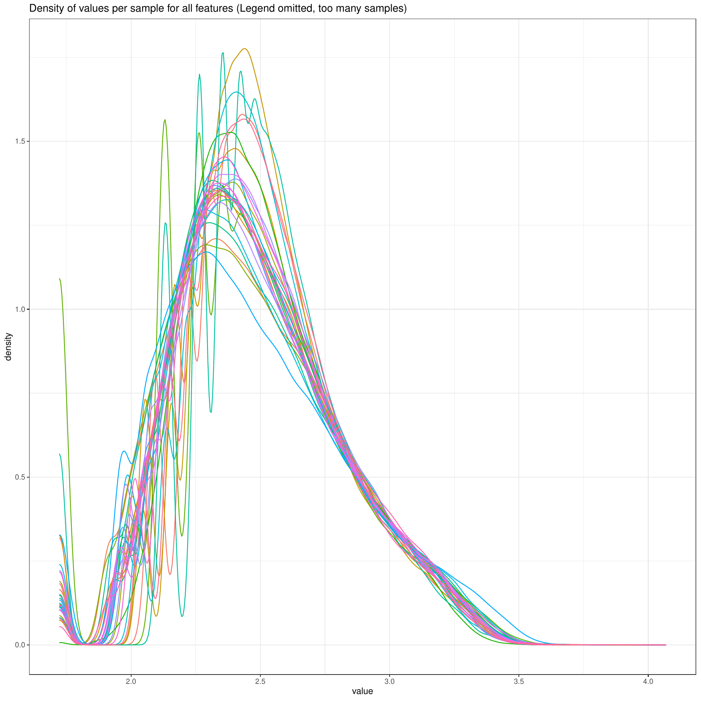 -->

<!--  ``` -->

2.  Screeplot (1 page)

<!--  ```{r, echo=FALSE, fig.cap="<i>PCA screeplot</i>", out.width = '80%'} -->

<!--  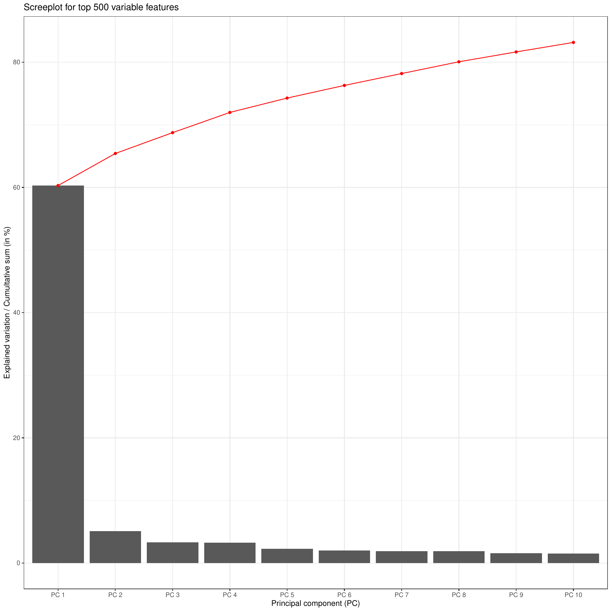 -->

<!--  ``` -->

3.  Metadata correlation plot

<!--  ```{r, echo=FALSE, fig.cap="<i>Metadata correlation plot for PCA</i>", out.width = '80%'} -->

<!--  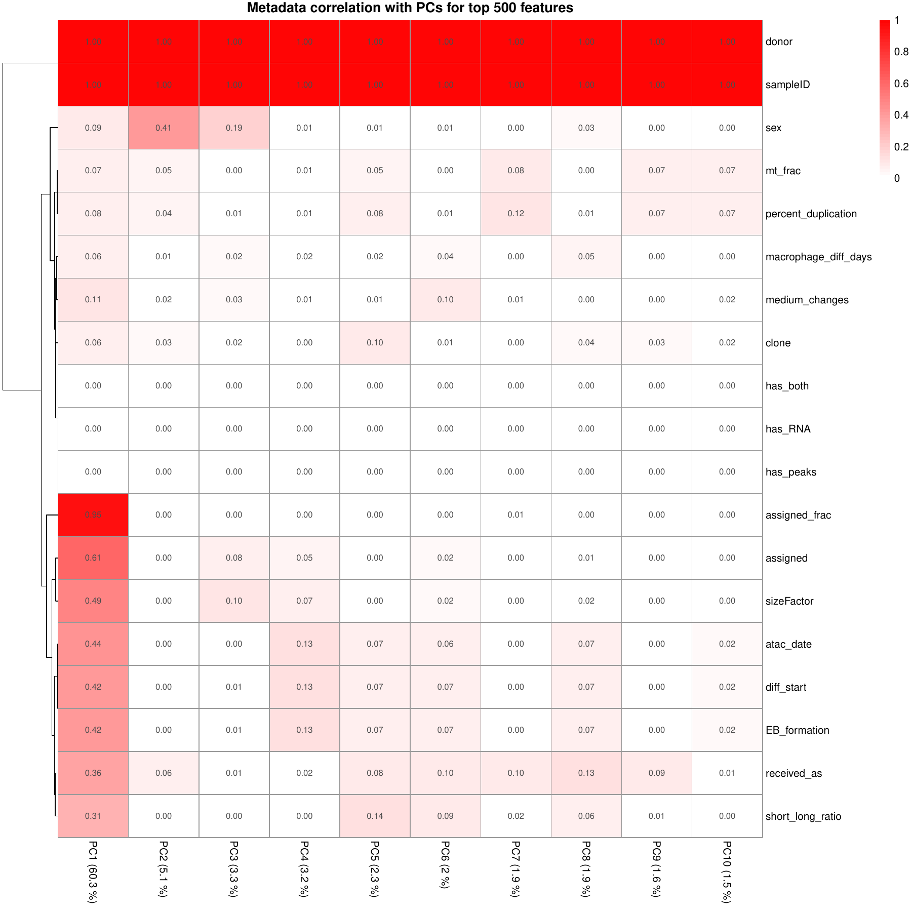 -->

<!--  ``` -->

4.  PCA plots with different metadata being colored (5 or more pages,
    depending on available metadata)

<!--  ```{r, echo=FALSE, fig.cap="<i>PCA plots for various metadata</i>", out.width = '100%'} -->

<!--  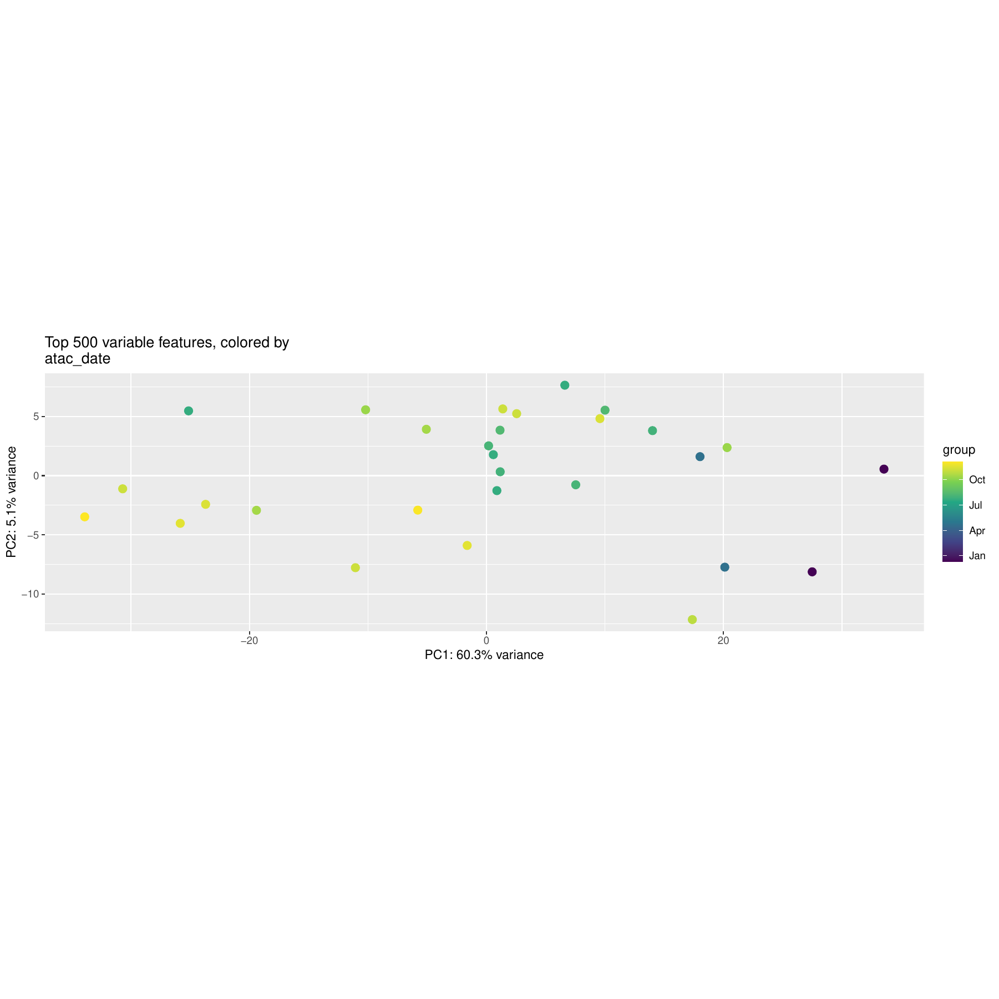 -->

<!--  ``` -->

Currently, the actual PCA result data are not stored in the `GRN`
object, but we may change this. We will update the Vignette once this is
done and mention it in the Changelog.

## TF-peak diagnostic plots {#output_TF_peak}

TF-peak diagnostic plots are available for each TF, and they currently
look as follows:

<!-- # ```{r, echo=FALSE, fig.cap="<i>TF-peak diagnostic plots for an example TF</i>", out.width = '100%'} -->

<!-- # 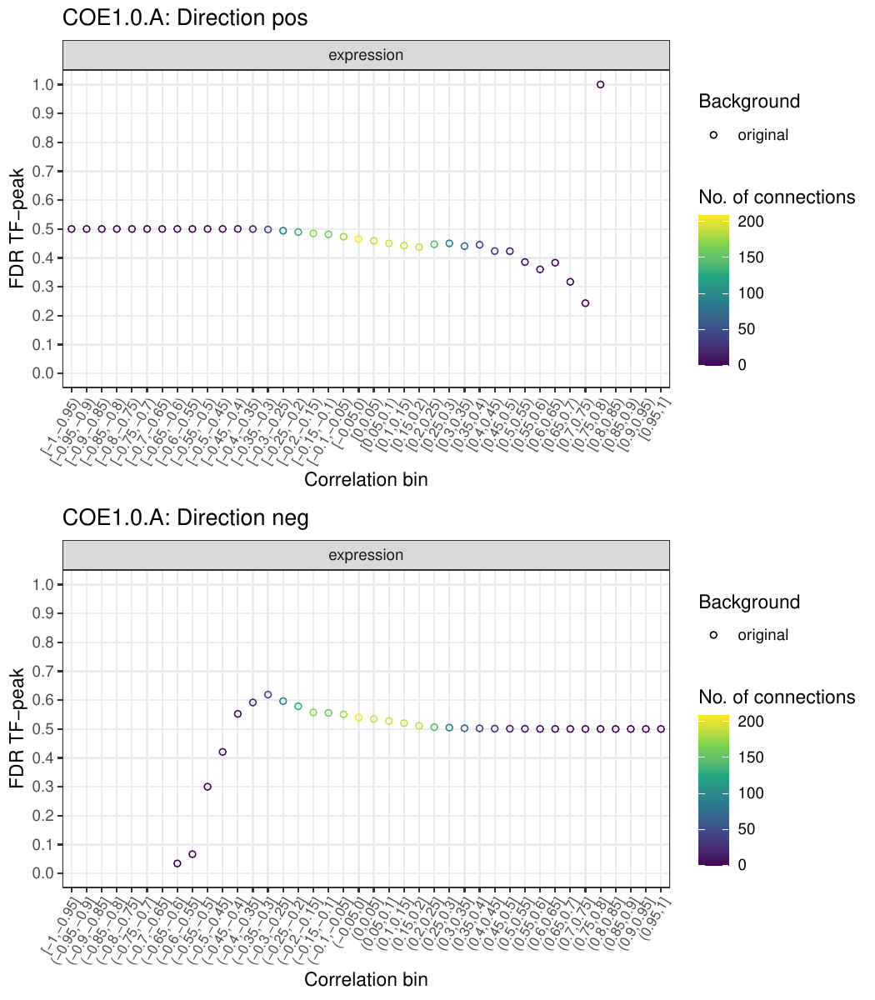 -->

<!-- # ``` -->

The TF name is indicated in the title, and each page shows two plots. In
each plot, the TF-peak FDR for each correlation bin (ranging from -1 to
1 in bins of size 0.05) is shown. The only difference between the two
plots is the directionality upon which the FDR is empirically derived
from: the upper plot is for the *positive* and the lower plot for the
*negative* direction. Each plot is also colored by the number of
distinct TF-peak connections that fall into the particular bin. Mostly,
correlation bins with smaller absolute correlation values have higher
frequencies (i.e., more TF-peak links fall into them) while correlation
bins with more extreme correlation values are less frequent. In the end,
for the resulting network, the directionality can be ignored and only
those TF-peak links are kept with small FDRs, irrespective of the
directionality.

## Activator-repressor classification diagnostic plots and results {#output_AR}

The pipeline produces 3 different plot types related to the
activator-repressor (AR) classification that can optionally be run as
part of the `GRaNIE` workflow. For each of the 3 types, plots are
produced for both the original, non-permuted (labeled as `original`) as
well as the permuted (labeled as `permuted`) data.

The AR classification is run for the RNA expression data (labeled as
`expression`) and can additionally also be run for TF activity data
(labeled as `TFActivity`, see the function `addConnections_TF_peak()`
and its parameter options).

In the following, the 3 plot types are briefly explained:

1.  **Summary heatmaps (files starting with
    `TF_classification_summaryHeatmap`)**: [This is described in detail
    in the `diffTF`
    documentation.](https://difftf.readthedocs.io/en/latest/chapter2.html#files-comparisontype-diagnosticplotsclassification1-pdf-and-comparisontype-diagnosticplotsclassification2-pdf)

    We explain and summarize this type of plot in the [Workflow
    Vignette](GRaNIE_workflow.html#output_AR). Please check there for
    details.

2.  **Classification stringency summary plots (files starting with
    `TF_classification_stringencyThresholds`)**: [This is described in
    detail in the `diffTF`
    documentation.](https://difftf.readthedocs.io/en/latest/chapter2.html#files-comparisontype-diagnosticplotsclassification1-pdf-and-comparisontype-diagnosticplotsclassification2-pdf)

    <!-- # ```{r, echo=FALSE, fig.cap="<i>Classification stringency summary plots for real data</i>", fig.show="hold", out.width="40%", fig.alignc="default"} -->
    <!-- # #knitr::include_graphics(c("figs/AR_stringency_expr_real/p-1.png", "figs/AR_stringency_expr_real/p-4.png")) -->
    <!-- # require(gridExtra) --> <!-- # require(png) -->
    <!-- # pre_fig <- grid::rasterGrob(png::readPNG("figs/AR_stringency_expr_real/p-1.png"), interpolate=TRUE) -->
    <!-- # post_fig <- grid::rasterGrob(png::readPNG("figs/AR_stringency_expr_real/p-4.png"), interpolate=TRUE) -->
    <!-- # grid.arrange(pre_fig, post_fig, ncol=2, nrow=1) -->
    <!-- # #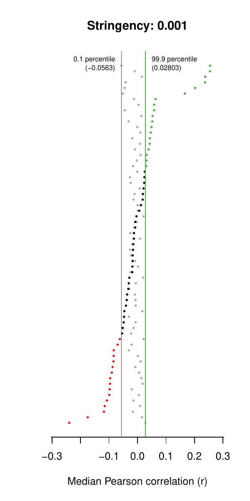 -->
    <!-- # ``` --> <!-- #  -->
    <!-- # ```{r, echo=FALSE, fig.cap="<i>Classification stringency summary plots for permuted data</i>", fig.align='center'} -->
    <!-- # #knitr::include_graphics(c("figs/AR_stringency_expr_perm/p-1.png", "figs/AR_stringency_expr_perm/p-4.png")) -->
    <!-- # 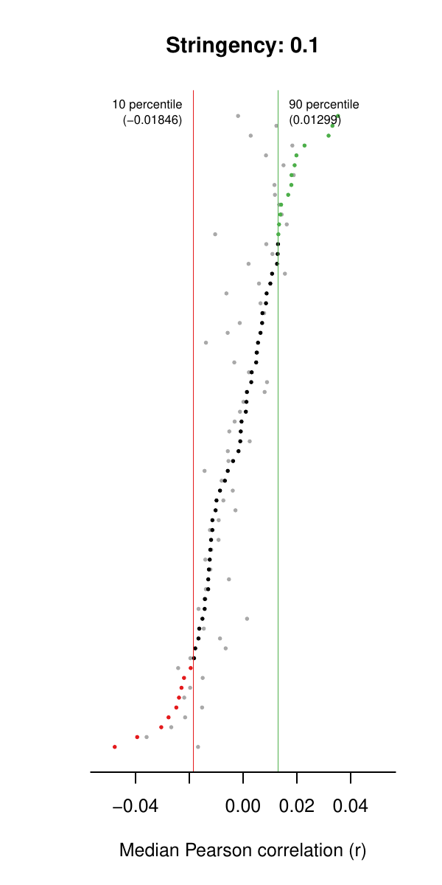 -->
    <!-- # 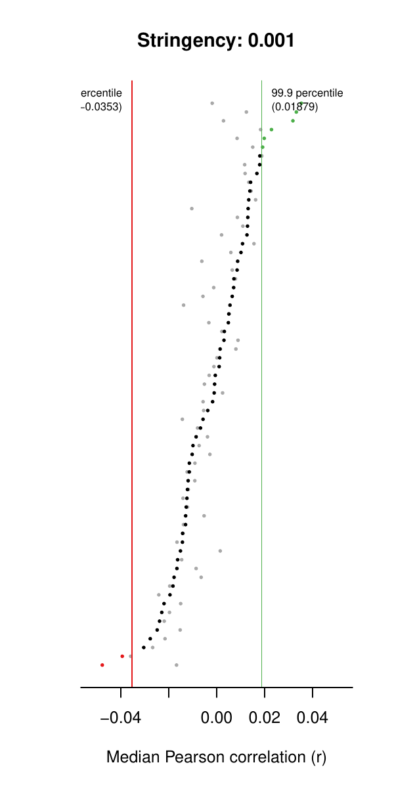 -->
    <!-- #  --> <!-- # ``` -->

3.  **Density plots per TF (files starting with
    `TF_classification_densityPlotsForegroundBackground`)**: Density
    plots for each TF, with one TF per page. The plot shows the
    foreground (red, labeled as `Motif`) and background (gray, labeled
    as `Non-motif`) densities of the correlation coefficient (either
    Pearson or Spearman, see x-axis label) from peaks with (foreground)
    or without (background) a (predicted) TFBS in the peak for the
    particular TF. The numbers in the parenthesis summarize the
    underlying total number of peaks.

    <!-- # ```{r, echo=FALSE, fig.cap="<i>Density plots for two selected TFs for real data</i>", out.width = '80%'} -->
    <!-- # 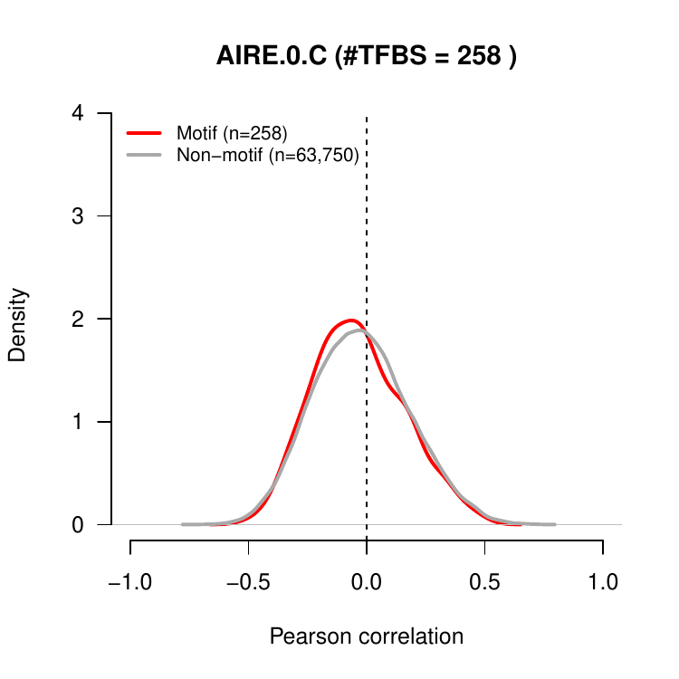 -->
    <!-- # 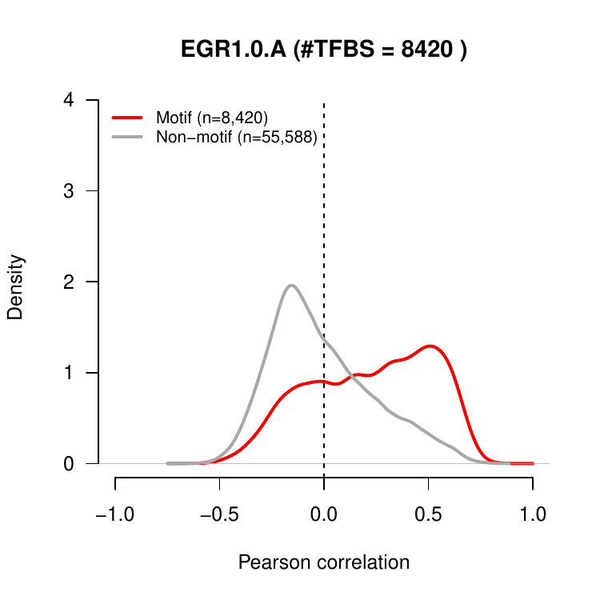 -->
    <!-- # ``` --> <!-- #  --> <!-- #  -->
    <!-- # ```{r, echo=FALSE, fig.cap="<i>Density plots for two selected TFs for permuted data</i>", out.width = '80%'} -->
    <!-- # 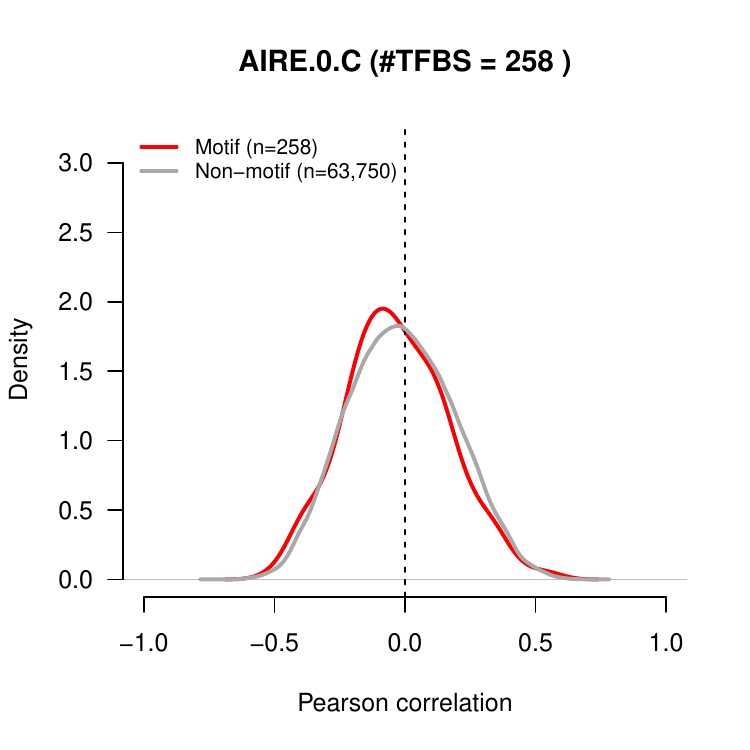 -->
    <!-- # 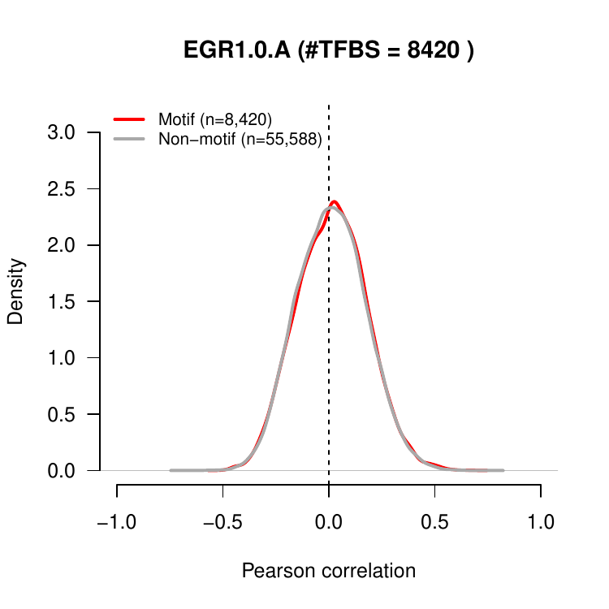 -->
    <!-- # ``` -->

It is also possible to extract the results from the AR classification
out of a `GRN` object. Currently, this can only be done manually,
extractor functions are in the works that will further enhance the user
experience. The results are stored in the slot
`GRN@data$TFs$classification[[permIndex]] [[connectionType]]$TF.classification`.
Here, `permIndex` refers to the original, non-permuted ("0") or permuted
("1") data, while `connectionType` here is either `expression` or
`TFActivity`, depending on whether the pipeline has also be run for TF
Activity in addition to expression (see function
`addConnections_TF_peak()`). Thus, typically, the results for the
original data are stored in
`GRN@data$TFs$classification[["0"]] [["expression"]]$TF.classification`.
If intermediate results from the classification have not been deleted
(the default is to delete them as they can occupy a large amount of
memory in the object, see the parameters of `AR_classification_wrapper`
for details), they can be accessed similarly within
`GRN@data$TFs$classification[[permIndex]] [[connectionType]]`:
`TF_cor_median_foreground`, `TF_cor_median_background`,
`TF_peak_cor_foreground`, `TF_peak_cor_background`, and
`act.rep.thres.l`.

## Peak-gene diagnostic plots {#output_peak_gene}

We provide a number of diagnostic plots for the peak-gene links that are
imperative for understanding the biological system and GRN. In what
follows, we describe them briefly, along with some notes on expected
patterns, implications etc. Note that this section is subject to
continuous change.

We currently offer a summary QC figure for the peak-gene connections
that looks as follows:

<!-- # ```{r, echo=FALSE, fig.cap="<i>Summary peak-gene QC figure</i>", out.width = '100%'} -->

<!-- # 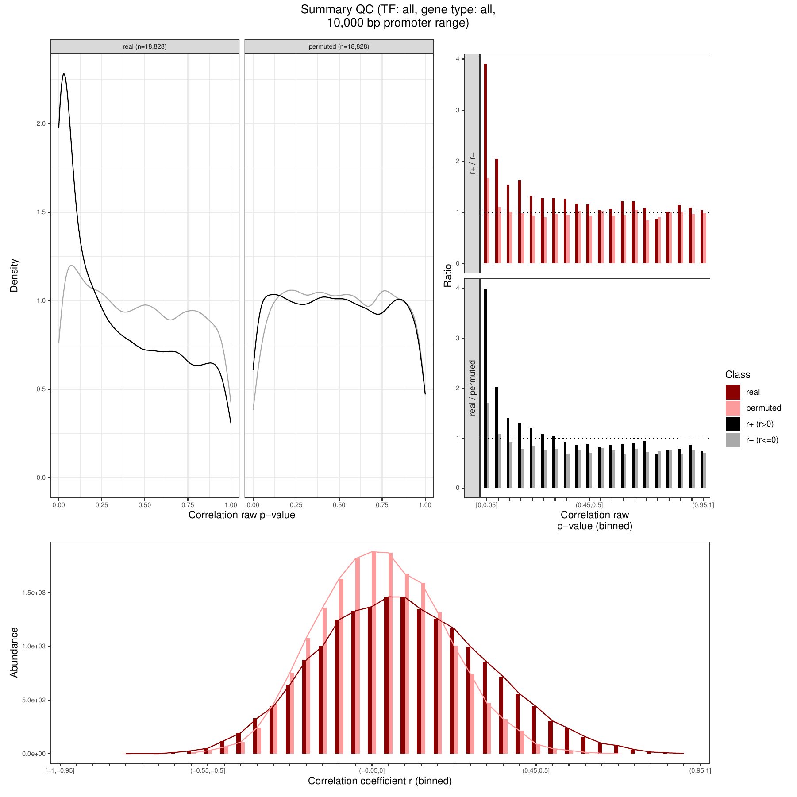 -->

<!-- # ``` -->

As you can see, the Figure is divided into two rows: the upper row
focuses on the peak-gene raw p-value of the correlation results, while
the lower row focuses on the peak-gene correlation coefficient. The left
side visualizes the data of the corresponding metrics via density plots,
while the right side bins the metrics and visualizes them with barplots
for highlighting differences between real and permuted data as well as
negatively and positively correlated peak-gene links (denoted as `r+`
and `r-`, respectively).

We now describe these plots in more detail.

### Correlation raw p-value distribution

<!-- unlikely that we are getting increased accessibility in a peak when a repressor binds based on the plots from diffTF (Fig3., repressor/activator footprints). I also think it’s due to strong differences in condition -->

First and most importantly, we focus on the distribution of the raw
p-values from the correlation tests (peak accessibility vs gene
expression) of all peak-gene links. We can investigate these from
multiple perspectives.

Let's start with a density plot. The upper left plot shows the raw
p-value density for the particular gene type as indicated in the title
(here: all gene types), stratified on two levels:

1.  Random (permuted, left) and non-random (real, right) connections
2.  Connections that have a negative (`r-`, gray) and positive (`r+`,
    black) correlation coefficient, respectively

Generally speaking, we consider both the random connections as well as
`r-` connections as background.

What we would like to see is:

-   random connections show little to no signal, with a flat curve along
    the x-axis, with little to no difference between `r+` and `r-`
    connections
-   for the real connections and `r+` links, a strong peak at small
    p-values, and a (marginally) flat distribution for higher ones
    (similar to a well-calibrated raw p-value distribution for any
    hypothesis test such as differential expression). For `r-` links,
    the peak at small p-values should be much smaller and ideally the
    curve is completely flat. However, from the datasets we examined,
    this is rarely the case.

If any of these quality controls is not met, it may indicate an issue
with data normalization, the underlying biology and what the GRN
represents, or an issue with data size or covariates influencing the
results.

To quantify the difference between `r+` and `r-` links within each
connection type (random vs real), we can also plot the results in form
of ratios rather than densities for either the `r+` / `r-` or the real /
permuted dimension. These plots are shown in the upper right panel of
the summary plot.

For the `r+` / `r-` dimension and permuted data, the ratios should be
close to 1 across all p-value bins, while for the real data, a high
ratio is typically seen for small p-values. In general, the difference
between the permuted and real bar should be large for small p-values and
close to 1 for larger ones.

For the real / permuted dimension, what we want to see is again a high
ratio for small p-value bins for the `r+` links, indicating that when
comparing permuted vs real, there are many more small p-value links in
real data as compared to permuted. This usually does not hold true for
the `r-` links, though, as can be seen also from the plot: the gray bars
are smaller and closer to 1 across the whole binned p-value range.

Lastly, we can also stratify the raw p-value distribution for `r+` and
`r-` peak-gene connections according to different biological properties
such as the peak-gene distance and others (see below). Here, we focus
solely on the real data and additionally stratify the p-value
distributions of peak-gene links by their genomic distance (measured as
the distance of the middle of the peak to the TSS of the gene, in base
pairs). For this, we bin the peak-gene distance equally into 10 bins,
which results in the bins containing a non-equal number of data points
but genomic distance is increased uniformly from bin to bin:

<!-- # ```{r, echo=FALSE, fig.cap="<i>Density of raw p-values, stratified by (1) peak-gene distance (using equally sized bins) and (2) `r+` / `r-` links</i>", out.width = '80%'} -->

<!-- # 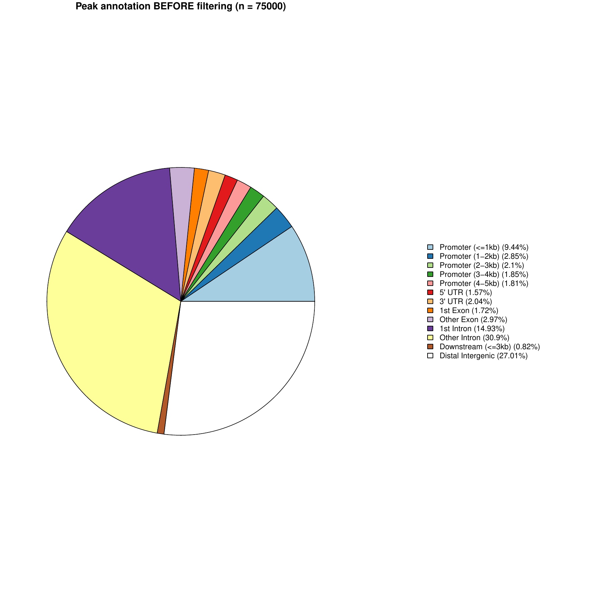 -->

<!-- # ``` -->

We generally (hope to) see that for smaller peak-gene distances (in
particular those that overlap, i.e., the peak and the gene are in direct
vicinity or even overlapping), the difference between r+ and r- links is
bigger as for more distant links. We also include the random links, for
which no difference between r+ and r- links is visible, as expected for
a well-calibrated background.

Let's plot the same, but stratified by peak-gene distance and `r+` /
`r-` within each plot instead:

<!-- # ```{r, echo=FALSE, fig.cap="<i>Density of raw p-values, stratified by (1) peak-gene distance (using equally sized bins) and (2) `r+` / `r-` links</i>", out.width = '80%'} -->

<!-- # 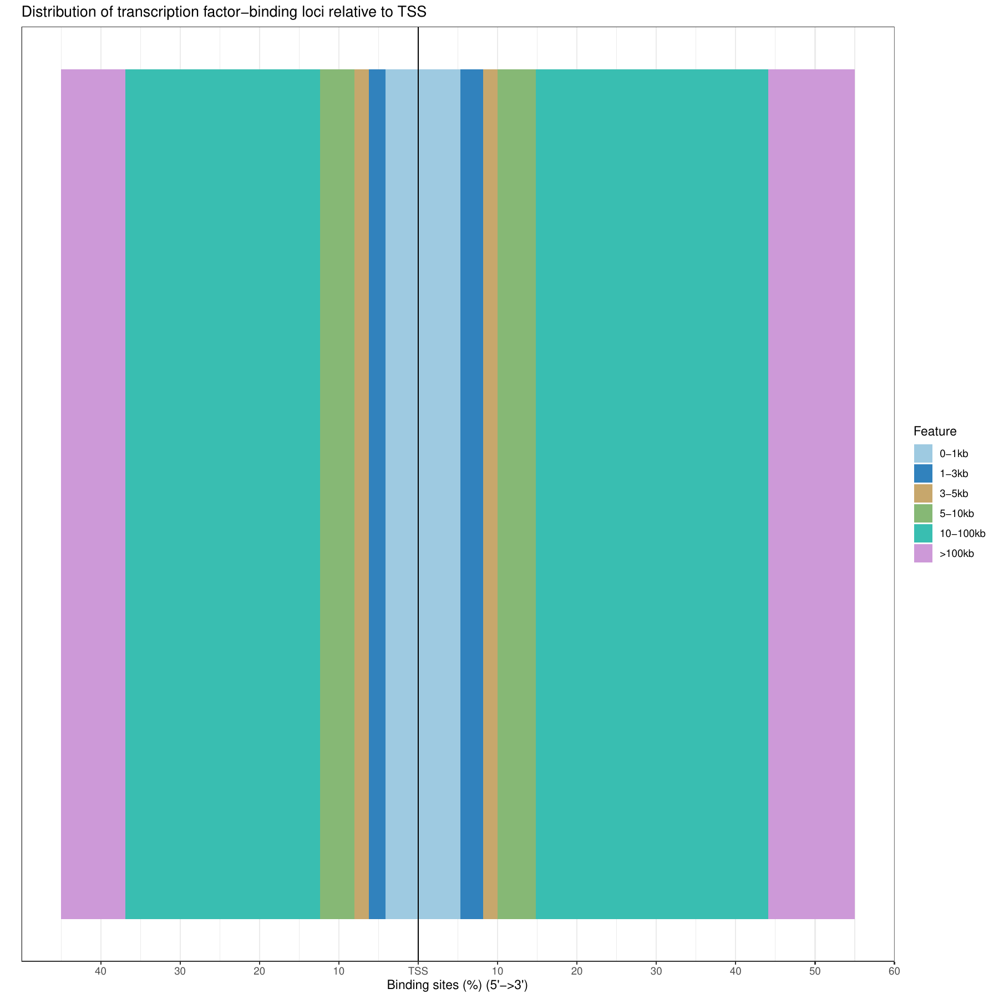 -->

<!-- # ``` -->

### Correlation coefficient distribution

So far, we analyzed the raw p-value distribution in detail. Let's focus
now on the distribution of the correlation coefficient per se.

<!-- # ```{r, echo=FALSE, fig.cap="<i>Density of the correlation coefficient, stratified by (1) peak-gene distance (using equally sized bins)</i>", out.width = '80%'} -->

<!-- # 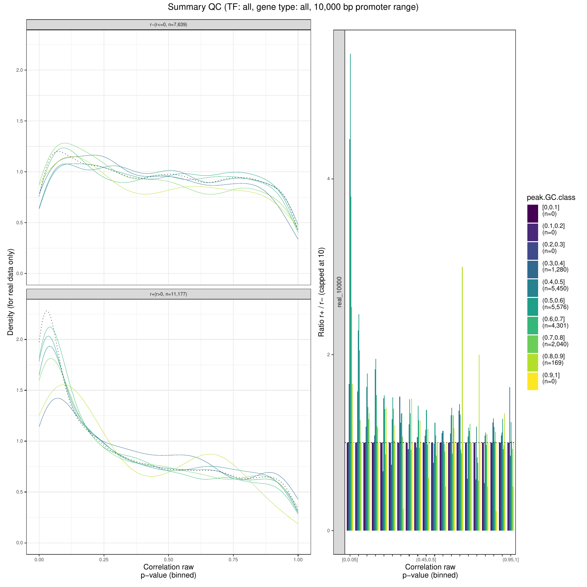 -->

<!-- # ``` -->

Here, we can also include the *random* links for comparison. We see that
the distribution of the correlation coefficient is also slightly
different across bins, and most extreme for links with a small genomic
distance (darker colored lines).

## Connection summary plots {#output_connectionSummary}

We currently offer two different connection summary PDFs, both of which
are produced from the function `plot_stats_connectionSummary()`. Both
PDFs shows the number of connections for each node type (TF, peak, and
gene), while in the boxplots, peaks are further differentiated into
TF-peak and peak-gene entities. They also iterate over various
parameters and plot one plot per page and parameter combination, as
indicated in the title:

1.  `allowMissingTFs`: `TRUE` or `FALSE` (i.e., allow TFs to be missing
    when summarizing the  `eGRN`  network. If set to `TRUE`, a valid
    connection may consist of just peak to gene, with no TF being
    connected to the peak. For more details, see the `R` help for
    `plot_stats_connectionSummary()`)
2.  `allowMissingGenes`: `TRUE` or `FALSE` (i.e., allow genes to be
    missing when summarizing the `eGRN` network. If set to `TRUE`, a
    valid connection may consist of just TF to peak, with no gene being
    connected to the peak. For more details, see the `R` help for
    `plot_stats_connectionSummary()`)
3.  `TF_peak.connectionType`. Either `expression` or `TFActivity` to
    denote which connection type the summary is based on.

Both plot types compare the connectivity for the real and permuted data
(denoted as `Network type` in the boxplot PDF), which allows a better
judgment of the connectivity from the real data.

An example page for the summary heatmap looks like this:

<!-- # ```{r, echo=FALSE, fig.cap="<i>Example heatmap for the connection summary</i>", out.width = '80%'} -->

<!-- # 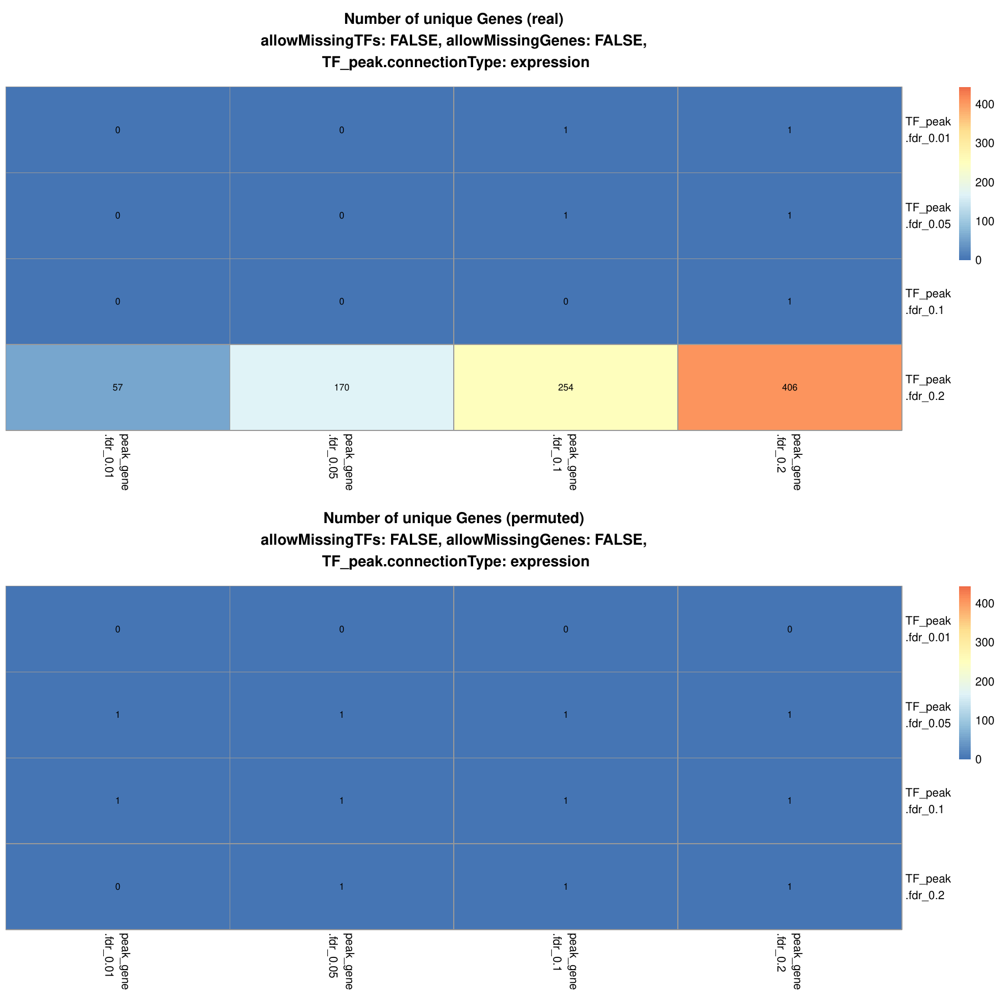 -->

<!-- # ``` -->

Here, two heatmaps are shown, one for real (top) and one for permuted
(bottom) network. Each of them shows for different combinations of
TF-peak and peak-gene FDRs (0.01 to 0.2) the number of unique node types
for the given FDR combination (here: TFs).

Second, a multi-page summary PDF for the connections in form of a
boxplot, as exemplified with the following Figure:

<!-- # ```{r, echo=FALSE, fig.cap="<i>Example boxplot for the connection summary</i>", out.width = '80%'} -->

<!-- # 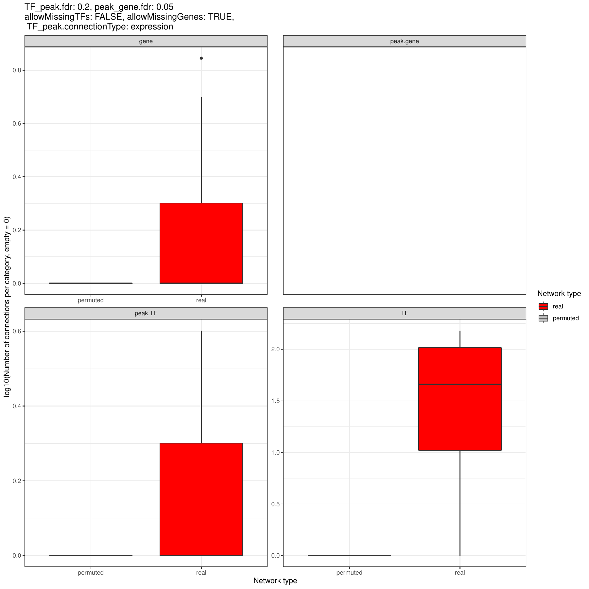 -->

<!-- # ``` -->

## Enrichment {#output_enrichment}

Here, we describe the output of the enrichment functions in more detail.

### General enrichment

The output is structured as follows:
- one page per ontology for the whole `eGRN` with an enrichment summary that includes the ontology terms (y-axis), the gene ratio (the number of genes found divided by the total number of genes in the foreground) on the x-axis, the raw p-value (color) and the absolute number of genes found (dot size). The plot title gives some additional information such as the chosen ontology, the statistic used, the used background, the number of genes in foreground and background, respectively, and the chosen multiple testing adjustment (if applicable; in some cases, this is ignored due to the way the enrichment calculation works)

### Community enrichment

The output is structured as follows:
- one page per ontology and community with an enrichment summary (see general enrichment above for explanations)
- two pages in the end that compare the community-enrichment with the general enrichment. Here, all ontology terms that are deemed significant according to the chosen significance threshold `p` (see function parameters) in either the general or the community-specific enrichment are included, along with their -log10-transformed statistical confidence (either raw or adjusted p-value). The top part shows the size of the general enrichment and the community-specific subnetworks (in number of genes they include). In contrast, the last page shows not all but only the top 10 enriched terms per column.

### TF enrichment

The output is structured in analogy to the community enrichment, but instead of communities, the regulon that a particular TF spans is chosen as subnetwork (i.e., all genes the TF is connected to).

## Output tables {#output_other}

During a typical `GRaNIE` analysis, all results are automatically stored
in `GRN` object that is used as input. The only exception is the
function `getGRNConnections()` that can be used to extract the resulting
`eGRN` network from a `GRN` object and returns a separate data frame and
**NOT** a `GRN` object. For more information, see the corresponding R help (
`?getGRNConnections`).

# Memory footprint and execution time, feasibility with large datasets {#resources}

In this section, we will give an overview over CPU and memory
requirements when running or planning an analysis with `GRaNIE`.

Both CPU time and memory footprint primarily depend on similar factors,
namely the number of

1.  TFs
2.  peaks
3.  samples

While the number of TFs is typically similar across analyses when the
default database is used (`HOCOMOCO` + `PWMScan`), the number of peaks
and samples may vary greatly across analyses.

**For optimized CPU times, make sure to have the package `BiocParallel`
installed, which is not automatically installed with `GRANIE`, even
though it should be already installed for most Bioconductor
installations as it is one of the core packages.**

## CPU time {#resources_cpu}

A typical analysis runs within an hour or two on a standard machine with
2 to 4 cores or so. CPU time non-surprisingly depends primarily on the
number of used cores for those functions that support multiple cores and
that are time-consuming in nature.

## Memory footprint {#resources_memory}

The maximum memory footprint can be a few GB in `R`. We recommend not
using more than a few 100,000 or so peaks as the memory footprint
as well as running time may otherwise increase notably. However, there is no package-defined upper limit,
it all depends on the available system memory.

Given that our approach is correlation-based, it seems preferable
to maximize the number of samples while retaining only peaks that carry
a biological signal that is differing among samples.

The size of the `GRN` object is typically in the range of a few hundred
MB, but can exceed 1 GB for large datasets. If you have troubles with
big datasets, let us know! We always look for ways to further optimize
the memory footprint. However, with the recent optimizations to store the count matrices as sparse matrix if the fraction of 0s is too large, the overall memory footprint significantly reduced.

# References {#refs}

1.  [GRaNIE and GRaNPA
    biorxiv](https://www.biorxiv.org/content/10.1101/2021.12.18.473290v3)
2.  [SCENIC+
    biorxiv](https://www.biorxiv.org/content/10.1101/2022.08.19.504505v1)
